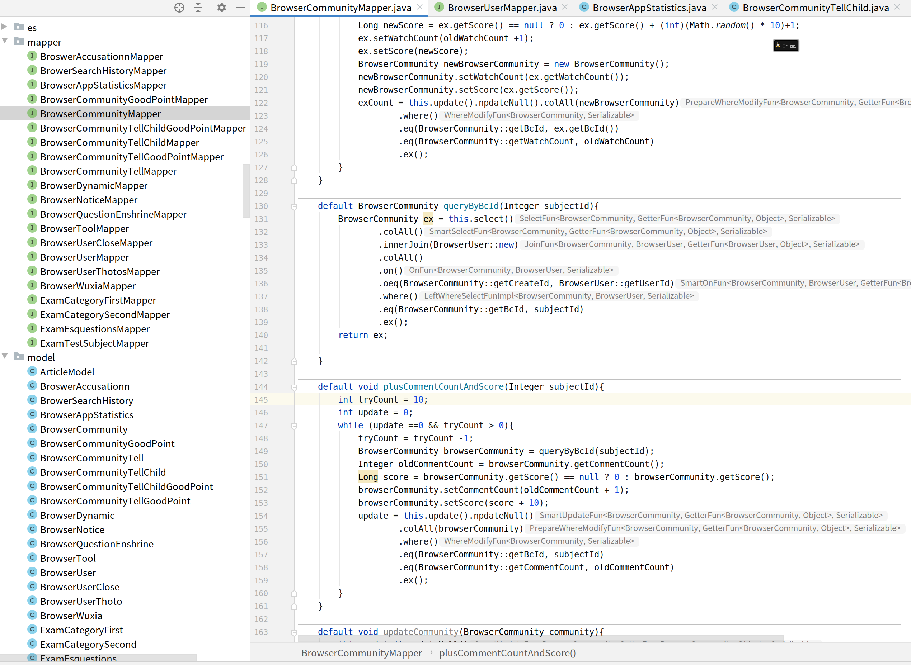

# Brief
<p>
<code>brief</code> Is a high-performance, lightweight, easy to use, zero configuration orm framework. Let complex SQL disappear, development efficiency maximization of shit and less amount of code and sustainable higher readability and maintainability.
This is the reason for the existence of the <code>brief</code>. <code>brief</code>Take you to experience unprecedented silky.
</p>

### Introduction
<p>
 Simplify the development. To write SQL like writing Java code. Here we call JQL. And form a set of JQL API process to reduce the SQL error rate. JQL aimed at the complex SQL is decomposed into simple SQL, this is the core of the development brief.
  <code>brief</code> Support for multiple table joins and does not require any mapping configuration. brief Support the new writing style.在<code>Mapper</code> The default method can directly manipulate JQL API（The premise is extends <code>BriefMapper</code>）。 
  Integrates the function of brief, can directly use the API. Let me written in Java streams JQL, improve the development efficiency. Less code and more smooth writing. The performance is twice that of mybatis.

</p>


## Lightweight machine version
<p>
<code>brief-speedier</code> Can be used alone. Do not rely on any environment.
sample ： https://github.com/javaoffers/briefest/blob/develop/brief-samples/brief-speedier-sample/src/main/java/com/javaoffers/base/modelhelper/sample/speedier/BriefSpeedierSample.java
</p>

- maven

  ```java
    <properties>
         <brief.version>3.6.2</brief.version>
    </properties>
   <!--brief Lightweight and can be used alone-->
     <dependency>
         <groupId>com.javaoffers</groupId>
         <artifactId>brief-speedier</artifactId>
         <version>${brief.version}</version>
   </dependency>
   ```
  
   ```java
    BriefSpeedier speedier = BriefSpeedier.getInstance(dataSource);
    BriefMapper<User> userBriefMapper = speedier.newDefaultBriefMapper(User.class);
    userList = userBriefMapper.select().colAll().where().limitPage(1, 10).exs();
    print(userList);
    ```

## Enhance mybatis
<p>
The <code>brief-mybatis</code> is mybatis increased, let <code>mybatis</code> has brief ability. So <code>brief-mybatis</code> is fully compatible with <code>mybatis</code>. If your project is used in the <code>mybatis</code> so you can directly introduced <code>brief-mybatis</code> dependence. Do change, enhance not only introduce it won't affect the existing engineering, silky smooth. Without any configuration. Just need to let your Mapper class inheritance <code>BriefMapper</code> can be used in the feature.
</p>

- maven
  ```
  
   <!--The brief-mybatis increased-->
   <dependency>
       <groupId>com.javaoffers</groupId>
       <artifactId>brief-mybatis</artifactId>
       <version>${brief.version}</version>
   </dependency>

  ```

## Brief-spring-boot-start
<p>
Later will support，support<code>spring-boot</code>. If your spring - the boot project cited mybatis framework, Then you only need to introduce <code>brief-mybatis</code> to mybatis can be enhanced..
</p>

## Function is introduced
- feature
  - High performance queries and insert
  - Don't have to write the native SQL. Can according to the stream of Java API to write.
  - SQL function annotation, simple and easy to use
  - New, supporting the mapper interface class write default default method.
  - Powerful automatic type conversion functions.
  - The optimization of the automatic identification of insert/update batch execution
  - Provide optional automatic identification of difference data real-time update capability 
  - Multi-table query does not need to be configured. Automatically map one-to-one, one-to-many, many-to-many.
  - Supports logical deletion, optimistic locking.
  - Integrated with the commonly used API, to directly using the need for development.
  - Support mysql grammar standard
  - Table fields automatic decryption (support like fuzzy query).
  - Field query fuzzy desensitization
  - SQL interceptors, are free to customize
  - SQL filter, are free to customize
  - Slow slow SQL monitor. Allow customizable handling of slow SQL.
  - Support json field.
  - Support automatic generation of unique keys

  
- Project of actual combat, which has been used internally. The effect is very good.


### Based on using    
#### Query operation
 <p>
Before we see operation, we first look at the data structure: there are two key annotation.
 @BaseModelUsed to represent the class belongs to the Model classes (class name is the same as the table name, the Model will Help the camel class name converted to underline the name of the table, attribute the same),
 @BaseUniqueIndicates the only class attributes (corresponding to A unique attribute in A table, when the primary key used in the table that can be more).
 We will be in the final detailed explanation of the use of annotations. The following is the basic use
 </p>
 
 ```java
@BaseModel
public class User {

    @BaseUnique
    private Long id;

    private String name;

    private String birthday;
    
    private Work work;
    
    private IsDel isDel;
    
    private Version version;  

    @CaseWhen(whens = {
            @CaseWhen.When(when = "money < 10", then = "'pool'"),
            @CaseWhen.When(when = "money > 10000", then = "'rich'")},
            elseEnd = @CaseWhen.Else("'civilian'")
    )
    private String moneyDes;    

    private List<UserOrder> orders;

    // .... getter setter
}

@BaseModel
public class UserOrder {

    @BaseUnique
    private int id;
    private String orderName;
    private String orderMoney;
      
    //getter, setter  methods  
} 


```

##### A full table query
 ```java

 List<User>  users = crudUserMapper 
                    .select() 
                    .colAll() 
                    .where() 
                    .exs(); 

 ```
 
  <p>
The JQL will eventually be translated into the select id, name, XXX.. From the user. Query all the table fields colall mean here. If you want to query the specified fields, such as your name and birthday field, can do it:</p>

##### The query specified table fields 
 ```java
 List<User> users = crudusermapper
                    .select()
                    .col (user:: getbirthday)
                    .col (user:: getname)
                    .where()
                    .exs();
 ```
 
##### The query specified conditions 
 <p>
By col () specifies fields to query. Here's where the where keyword in the () and SQL is the same. Such as to query a user id value is 1, you can write like this: </p>
 
 ```java
 User user = crudusermapper
             .select() 
             .colAll() 
             .where() 
             .eq(User::getId, 1) 
             .ex();
 ```

##### Paging query

```java
 int pageNum = 1;
 int pageSize = 10;
 List<User> users = crudusermapper
                    .select()
                    .col (user:: getbirthday)
                    .col (user:: getname)
                    .where()
                    .limitPage(1, 10)//  1: the first page, query 10 data
                    .exs();
 
```

##### Statistical query
```java
List<User> users = this.crudUserMapper
                       .select()
                       .col(User::getId)
                       .innerJoin(UserTeacher::new)
                       .col(UserTeacher::getTeacherId)
                       .on()
                       .oeq(User::getId, UserTeacher::getId)
                       .innerJoin(Teacher::new)
                       .col(Teacher::getId)
                       .col(AggTag.MAX, Teacher::getName)
                       .on()
                       .oeq(UserTeacher::getTeacherId, Teacher::getId)
                       .where()
                       .gt(User::getId, 0)
                       .groupBy(Teacher::getId)
                       .groupBy(UserTeacher::getTeacherId)
                       .groupBy(User::getId)
                       .having()
                       .gt(AggTag.MAX, User::getId, 0)
                       .gt(AggTag.MAX, UserTeacher::getId, 0)
                       .gt(AggTag.MAX, Teacher::getId, 0)
                       .orderA(User::getId)
                       .orderA(UserTeacher::getId)
                       .orderA(Teacher::getId)
                       .exs();
```

 <p>
You will find that there are two special function of exs (), the ex () these two functions on behalf of the trigger. Exs () is usually used to query more data, and returns the result to the list, while the ex T () is used to return a result; JQL must pass to trigger the where and the ex/exs. Most work situations, WHERE behind will add filter conditions, in addition to the special all table data statistics, this design also is very good remind you remember to fill in the WHERE condition, of course, if you don't need to add any WHERE conditions for all table data in the query, you can use the WHERE () the ex (), WHERE () exs () </p>  
 <p>
  More complex queries：https://github.com/caomingjie-code/Mybatis-ModelHelper/blob/master/brief-sample/src/main/java/com/javaoffers/base/modelhelper/sample/spring/SpringSuportCrudUserMapperSelete.java
 </p>

#### The insert

```java
Id exOne = crudUserMapper
                .insert()
                .col(User::getBirthday, new Date())
                .col(User::getName, "Jom")
                .ex();
```
<p>
A simple insert statement, returns a wrapper class Id, are usually the primary key of the newly inserted data. An insert it's as simple as that. There's a more simple way to insert the data. Insert the object. And support multiple. The formation logic for batch is optimized. For example, the following case
</p>

```java
        User user = User.builder().name("Jom1").birthday(date).build();
        
        List<Id> ex = crudUserMapper
                      .insert()
                      .colAll(user)
                      .ex();
        print(ex);
```

<p>

  We can insert the whole model object, said to query all of the fields, for batch layer. Performance is very good.
  More cases please reference：https://github.com/caomingjie-code/Mybatis-ModelHelper/blob/master/brief-sample/src/main/java/com/javaoffers/base/modelhelper/sample/spring/SpringSuportCrudUserMapperInsert.java

</p>

#### The update operation
<p>
Allows you to update the Null update npdate Null Null, are not allowed to update the Null values, there is update or insert, optimistic locking version update, batch updates,
Please see the following case
</p>

```java
crudUserMapper
        .update().npdateNull()
                 .col(User::getBirthday, new Date())
                 //The name does not update. Because of its npdate Null
                 .col(User::getName,null)
                 .where()
                 .eq(User::getId, id)
                 .ex();

crudUserMapper
        .update().updateNull()
                 .col(User::getBirthday, new Date())
                 //The name will be updated. Because it is the update of the Null
                 .col(User::getName,null)
                 .where()
                 .eq(User::getId, id)
                 .ex();

this.crudUserMapper.general().saveOrModify(user);

this.crudUserMapper.general().saveOrUpdate(user);

this.crudUserMapper.general().vsModifyById(user);

this.crudUserMapper.general().modifyBatchById(user);

this.crudUserMapper.general().updateBatchById(user);

```

<p>
Through the above case, we can very good control in the business field of updates.
</p>

#### Update tracking difference
<p>
    Differences can real-time tracking updates. When data change model for automatic updates.
    Want to use this feature only needs to be  <code>@BaseModel</code> autoUpdate = true.
    After open the query each with a primary key id data are able to provide a different update.
    In the process of operation if the primary key id is set to null, 
    The differences will lose the ability to update the model data and not reply even if you restore the primary key id.
    
</p>

```java

   @Data
   @BaseModel(value = "encrypt_data",autoUpdate = true)
   public class EncryptDataAutoUpdate {
   
       @BaseUnique
       private Integer id;
   
       private String encryptNum;
   }
   EncryptDataAutoUpdate encryptData = new EncryptDataAutoUpdate();
   encryptData.setEncryptNum("12345678");
   Id id = autoUpdateBriefMapper.general().save(encryptData);

   EncryptDataAutoUpdate autoUpdate = autoUpdateBriefMapper.general().queryById(id);
   print(autoUpdate);
   //Not updated, because there is no difference
   autoUpdate.setEncryptNum("12345678");
   //Will be updated
   autoUpdate.setEncryptNum("87654321900");
   print(autoUpdate);
   
   encryptData = this.autoUpdateBriefMapper.general().queryById(id);
   print(encryptData);
   //Cancel the differences to update
   encryptData.setId(null);
   //Not updated, as has already been canceled difference update functionality;
   encryptData.setEncryptNum("098712345");

```


#### Delete operation
<p>
<code>brief</code>Support rich delete functions. At the same time also delete support logic. 
Use logic to delete need use <code>IsDel/RowStatus</code> in the <code>User</code>  enumeration.
</p>

```java
 
crudUserMapper.delete()
               .where()
               .eq(User::getId, id)
               .eq(User::getName, 'xxx')
               .ex();   
this.crudUserMapper.general().remove(user);
this.crudUserMapper.general().removeById(id);
this.crudUserMapper.general().removeByIds(id1,id2,id3);
this.crudUserMapper.general().removeByIds(idList);
this.crudUserMapper.general().logicRemove(user);
this.crudUserMapper.general().logicRemoveById(id);
```


#### Support the default write JQL/SQL Mapper interfaces
<p>
A new kind of coding style. We can in <code>Mapper</code> Write the default method in the interface.
Used for centralized management JQL/SQL. Prevent project in JQL/SQL are everywhere.
For example, the following case (we recommend this kind of style).
</p>

```java
public interface CrudUserMapper extends BriefMapper<User> {

    default User queryUserById(Number id){
        return select()
                .colAll()
                .where()
                .eq(User::getId, id)
                .ex();
    }
   
}
```

<p>
When we interface inheritance <code>BriefMapper</code>  ，
We can write our JQL logic by default。
Please see more cases:https://github.com/caomingjie-code/Mybatis-ModelHelper/blob/master/brief-sample/src/main/java/com/javaoffers/base/modelhelper/sample/spring/mapper/BriefUserMapper.java
</p>

- sample crud:
  - demo ：https://github.com/caomingjie-code/Mybatis-ModelHelper/blob/master/brief-sample/src/main/java/com/javaoffers/base/modelhelper/sample/spring
    
#### Multi-table join 
- This part mainly introduces how to use JQL to express complex query. Does not require any configuration to join multiple tables (zero configuration).
<p>
On the basis of the above section, we explained some of the common and the most basic purpose. Next, we will introduce some scenes in the actual project. Some of the slightly more complicated cases. Mainly includes the join query, grouping query, statistic query and commonly used common operations.
</p>

<p>
The commonly used API JQL provides rich. For example, > =, =, and in between, like, like Left, like Right, exists, and so on. There is also a combination unite, mainly is the combined into a multiple conditions, such as xx or xx (xx > xx) for a two associated conditions. At the same time we let you write native SQL entry, such as col (SQL), cond SQL (SQL), although we usually don't recommend to use native SQL. Because as far as possible do not use SQL for complex logical processing, such as capture some string. Or etc, these actions suggested in the business layer. Start with a simple join JQL case: write JQL recommended in the interface class
</p>

```java
public interface CrudUserMapper extends BriefMapper<User> {
    
    default List<User> queryAllAndOrder(){
        return   select()
                .colAll()
                .leftJoin(UserOrder::new)
                .colAll()
                .on()
                .oeq(User::getId,UserOrder::getUserId)
                .where()
                .exs();
    }
}
```


##### use left join , group by , limitPage  
  
      
```java
 crudUserMapper.select()
                .col(AggTag.MAX, User::getName)
                .leftJoin(UserOrder::new)
                .col(AggTag.MAX, UserOrder::getOrderName)
                .on()
                //OXX The beginning indicates the relationship between two tables
                .oeq(User::getId, UserOrder::getUserId)
                .where()
                //Group by main table
                .groupBy(User::getName, User::getId)
                //Group according to sub-table
                .groupBy(UserOrder::getUserId)
                //1:pageNum,10:pageSize
                .limitPage(1,10)
                .exs();

```

####  Generic API

<p>
I enclosed some of the commonly used functions, use rise very simple. And the code is very concise and clear. For example, by id query or change.
</p>

<p>
  Commonly used API just call the general () method can be used. Such as through the id data
</p>

```java
//query by id
User user = crudUserMapper.general().queryById(id);
```

<p>
   Save the API, to save an object to the database
</p>

```java
 User user = User.builder().name("general").build();
 //save
 long saveId = crudUserMapper.general().save(user);
```

<p>
    By id delete specified data
</p>

```java
crudUserMapper.general().removeById(1);
```

<p>
  Commonly used simple API is as follows
</p>

```java

     /**
         * save model
         * @param model class
         * @return primary key id
         */
        public Id save(T model);
    
        /**
         * save or modify.
         * sql :  insert into on duplicate key update
         * @param model class
         * @return  primary key id. or modify count num. so return void
         */
        public void saveOrModify(T model);
    
        /**
         * save or update.
         * By the @UniqueId field to query data, if the query not null then to update, or to insert.
         * @param model class
         * @return  primary key id. or modify count num. so return void
         */
        public void saveOrUpdate(T model);
    
        /**
         * save or replace
         * sql: replace into
         * @param model class
         * @return   primary key id. or modify count num. so return void
         */
        public void saveOrReplace(T model);
    
        /**
         * save model
         * @param models class
         * @return primary key ids
         */
        public List<Id> saveBatch(Collection<T> models);
    
        /**
         * save or modify.
         * sql :  insert into on duplicate key update
         * @param models class
         * @return primary key id. or modify count num. so return void
         */
        public void saveOrModify(Collection<T> models);
    
        /**
         * save or update.
         * By the @UniqueId field to query data, if the query not null then to update, or to insert.
         * @param models class
         * @return  primary key id. or modify count num. so return void
         */
        public void saveOrUpdate(Collection<T> models);
    
        /**
         * save or replace
         * sql: replace into
         * @param models class
         * @return primary key id. or modify count num. so return void
         */
        public void saveOrReplace(Collection<T> models);
    
        /**
         * delete model.Where conditions will be generated based on properties of the model
         * class for which there is a value.
         * Note that this is a physical deletion
         * @param model
         */
        public int remove(T model);
    
        /**
         * delete model by id
         * Note that this is a physical deletion
         */
        public int removeById(Serializable id );
    
        /**
         * delete model by ids
         * Note that this is a physical deletion
         */
        public int removeByIds(Serializable... ids );
    
        /**
         * delete model by ids
         * Note that this is a physical deletion
         */
        public <ID extends Serializable> int removeByIds(Collection<ID> ids);
    
        /**
         * logic delete model.Where conditions will be generated based on properties of the model
         * class for which there is a value.
         * {@link IsDel}
         * {@link RowStatus}
         * @param model
         */
        public int logicRemove(T model);
    
        /**
         * logic delete model by id
         * {@link IsDel}
         * {@link RowStatus}
         */
        public int logicRemoveById(Serializable id );
    
        /**
         * logic delete model by ids
         * {@link IsDel}
         * {@link RowStatus}
         */
        public int logicRemoveByIds(Serializable... ids );
    
        /**
         * logic delete model by ids
         * {@link IsDel}
         * {@link RowStatus}
         */
        public <ID extends Serializable> int logicRemoveByIds(Collection<ID> ids);
    
        /**
         * Update the model, note that the update condition is the property marked with the Unique annotation.
         * Only properties with values ​​are updated.
         * In other words, the @BaseUnique annotation will generate a Where condition, and other non-null properties will
         * generate a set statement.
         * 支持版本更新
         * @param model model
         * @return The number of bars affected by the update
         */
        public int modifyById(T model);
    
        /**
         * Update the model, note that the update condition is the property marked with the Unique annotation.
         * Only properties with values ​​are updated.
         * In other words, the @BaseUnique annotation will generate a Where condition, and the field will
         * generate a set statement
         * @param model model
         * @return The number of bars affected by the update
         */
        public int updateById(T model);
    
        /**
         * batch update. Empty fields will not be able to update the database.
         * @param models models
         * @return Affect the number of bars
         */
        public int modifyBatchById(Collection<T> models);
    
        /**
         * batch update ,Will update the database if the field is empty.
         * @param models models
         * @return Affect the number of bars
         */
        public int updateBatchById(Collection<T> models);
        
        /**
         * Support version update.
         * Update the model, note that the update condition is the property marked with the Unique annotation.
         * Only properties with values ​​are updated.
         * In other words, the @BaseUnique annotation will generate a Where condition, and other non-null properties will
         * generate a set statement.
         * @param model model
         * @return The number of bars affected by the update
         */
        public int vsModifyById(T model);
    
        /**
         * Support version update.
         * Update the model, note that the update condition is the property marked with the Unique annotation.
         * Only properties with values ​​are updated.
         * In other words, the @BaseUnique annotation will generate a Where condition, and the field will
         * generate a set statement
         * @param model model
         * @return The number of bars affected by the update
         */
        public int vsUpdateById(T model);
    
        /**
         * Support version update.
         * batch update. Empty fields will not be able to update the database.
         * @param models models
         * @return Affect the number of bars
         */
        public int vsModifyByIds(Collection<T> models);
    
        /**
         * Support version update.
         * batch update ,Will update the database if the field is empty.
         * @param models models
         * @return Affect the number of bars
         */
        public int vsUpdateByIds(Collection<T> models);
    
        /**
         * Query the main model, be careful not to include child models. Non-null properties will generate a where statement.
         * <>Note that properties such as Collection<Model> will be ignored, even if they are not null </>
         * @param model model
         * @return return query result
         */
        public List<T> query(T model);
    
        /**
         * Query the main model, be careful not to include child models. Non-null properties will generate a where statement.
         * <>Note that properties such as Collection<Model> will be ignored, even if they are not null </>
         * @param model model
         * @param pageNum page number
         * @param pageSize Number of bars displayed per page
         * @return return query result
         */
        public List<T> query(T model,int pageNum,int pageSize);
    
        /**
         * Paging query full table data
         * @param pageNum page number, If the parameter is less than 1, it defaults to 1
         * @param pageSize Number of bars displayed per page， If the parameter is less than 1, it defaults to 10
         * @return return query result
         */
        public List<T> query(int pageNum,int pageSize);
    
        /**
         * query by id
         * @param id primary key id
         * @return model
         */
        public T queryById(Serializable id);
    
        /**
         * query by id
         * @param ids primary key id
         * @return model
         */
        public List<T> queryByIds(Serializable... ids);
    
        /**
         * query by id
         * @param ids primary key id
         * @return model
         */
        public <ID extends Serializable>  List<T> queryByIds(Collection<ID> ids);
    
        /**
         * query by id
         * @param ids primary key id
         * @return model
         */
        public <ID extends Serializable> List<T> queryByIds(List<ID> ids);
    
        /**
         * query by id
         * @param ids primary key id
         * @return model
         */
        public <ID extends Serializable> List<T> queryByIds(Set<ID> ids);
    
    
        /**
         * Map<String,Object>. String: Field names of the table. The value corresponding to the Object field
         * @param param Parameters. key database field name, value field value
         * @return model
         */
        public List<T> queryByParam(Map<String,Object> param);
    
        /**
         * Map<String,Object>. String: Field names of the table. The value corresponding to the Object field
         * @param param Parameters. key database field name, value field value
         * @param pageNum page number
         * @param pageSize Number of bars displayed per page
         * @return model
         */
        public List<T> queryByParam(Map<String,Object> param,int pageNum,int pageSize);
    
        /**
         * The number of statistical tables
         * @return not null
         */
        public Number count();
    
        /**
         * The number of statistical tables, through the specified field
         * @return not null
         */
        public Number count(C c);
    
        /**
         * The number of statistical tables, through the specified field
         * Statistical results after deduplication. count(DISTINCT c)
         * @return not null
         */
        public Number countDistinct(C c);
    
    
        /**
         * The number of statistical tables.  Will use the model as the where condition
         * @return not null
         */
        public Number count(T model);
    
        /**
         * The number of statistical tables, through the specified field.
         * Will use the model as the where condition
         * @return not null
         */
        public Number count(C c,T model);
    
        /**
         * The number of statistical tables, through the specified field
         * Statistical results after deduplication. count(DISTINCT c).
         * Will use the model as the where condition
         * @return not null
         */
        public Number countDistinct(C c,T model);

```
#### SQL function annotation
<p>
  We can pass on the field of class use annotations to use SQL functions. Here are some use cases:
</p>

```java
public class FunAnnoParserSample {
    @ColName("name")
    @Left(10)
    private String colName1; //LEFT(name,10)

    @ColName("name")
    @Left(10)
    @Concat( {"age"})
    private String colName2; //CONCAT(LEFT(name,10),age)


    @Left(10)
    @Concat( {"age"})
    private String colName3;//CONCAT(LEFT(colName3,10),age)

    @Now
    @Left(10)
    @Concat( {"age"})
    private String colName4;//CONCAT(LEFT(NOW(),10),age)


    @Concat( {"age"})
    private String colName5;//CONCAT(colName5,age)

    @Now
    @Concat({"age"})
    @Left(10)
    private String colName6;//LEFT(CONCAT(NOW(),age),10)


    @Concat({"age"})
    @Left(10)
    private String colName7;//LEFT(CONCAT(colName7,age),10)

    @Now
    @Left(10)
    private String colName8;//LEFT(NOW(),10)


    @Rand
    private String colName9;//RAND()

    @Rand
    @ColName("name")
    private String colName10;//java.lang.IllegalArgumentException: @ColName and @RAND cannot be used together

    @ColName("name")
    @IfNull("'Amop'")
    private String colName11;//IFNULL(name,'Amop')

    @ColName("sex = 1")
    @If(ep1 = "'boy'",ep2 = "'girl'")
    private String colName12;//IF(sex = 1,'boy','girl')

    /**
     * select if(1,'1','0') output 1
     * select if(0,'1','0') output 0
     */
    @ColName("sex")
    @IfNull("1")
    @If(ep1 = "'boy'", ep2 = "'girl'")
    private String colName13;// IF(IFNULL(sex,1),'boy','girl')

    @ColName("sex")
    @IfEq(eq = "1",ep1 = "'boy'", ep2 = "'girl'")
    private String colName14; //IF(sex = 1,'boy','girl')

    @ColName("money")
    @IfNotNull("'rich'")
    private String colName15; // IF(money is not null ,'rich',null)

    @ColName("money")
    @IfNotNull(value = "'rich'",ifNull = "'poor'")
    private String colName16; //IF(money is not null ,'rich','poor')

    @ColName("money")
    @IfNotNull(value = "'rich'",ifNull = "'poor'")
    @IfEq(eq = "'rich'",ep1 = "'i want to marry him'", ep2 = "'i want to break up with him'")
    private String colName17; //IF(IF(money is not null ,'rich','poor') = 'rich','i want to marry him','i want to break up with him')

    @ColName("money")
    @IfGt(gt = "100000",ep1 = "'rich'", ep2 = "'poor'")
    @IfEq(eq = "'rich'",ep1 = "'i want to marry him'", ep2 = "'i want to break up with him'")
    private String colName18; //IF(IF(money > 100000,'rich','poor') = 'rich','i want to marry him','i want to break up with him')

    @ColName("name")
    @Trim
    private String colName19; //TRIM(name)

    @ColName("name")
    @Concat(value = "'hello'", position = -1)
    private String colName20;//CONCAT('hello',name)

    @ColName("name")
    @Concat(value = "'hello'", position = 1)
    private String colName21; //CONCAT('hello',name)

    @ColName("name")
    @Concat(value = {"'hello'"," 'how are you?' "}, position = 1)
    private String colName22;//  CONCAT('hello',name, 'how are you?' )


    @ColName("name")
    @GroupConcat
    private String colName23;//GROUP_CONCAT( name )

    @ColName("name")
    @GroupConcat(distinct = true)
    private String colName24;//GROUP_CONCAT( distinct name )

    @ColName("name")
    @GroupConcat(distinct = true, orderBy = @GroupConcat.OrderBy(colName = "age",sort = GroupConcat.Sort.ASC) )
    private String colName25;//GROUP_CONCAT( distinct name  order by age ASC)

    @ColName("name")
    @GroupConcat(distinct = true, orderBy = @GroupConcat.OrderBy(colName = "age",sort = GroupConcat.Sort.DESC) ,separator = "-")
    private String colName26;//GROUP_CONCAT( distinct name  order by age DESC separator '-')

    @ColName("name")
    @Concat("age")
    @GroupConcat(distinct = true, orderBy = @GroupConcat.OrderBy(colName = "age",sort = GroupConcat.Sort.DESC) ,separator = "-")
    private String colName27;//GROUP_CONCAT( distinct CONCAT(name,age)  order by age DESC separator '-')
    
    @CaseWhen(whens = {
            @CaseWhen.When(when = "score > 80", then = "'Grand'"),
            @CaseWhen.When(when = "score < 80 and score > 50", then = "'General'"),
            @CaseWhen.When(when = "score < 50 and score > 10", then = "'noGood'"),
    }, elseEnd = @CaseWhen.Else("'VeryBad'"))
    private String scoreDescription;

}
```
#### Automatic type conversion
<p>
Built a large number of commonly used types of converters.
Such as database field birthday is a datetime/int, Number/varchar and enumeration class conversion between.
Enumeration classes usually and @ Enum Value are used together, identifies the enumeration class the only attribute, the attribute and the fields in the table automatically.
(sample of enum :https://github.com/javaoffers/brief/blob/develop/brief-sample/src/main/java/com/javaoffers/base/modelhelper/sample/spring/SpringSuportCrudUserMapperInsert.java ). 
</p>

```
   String2DoubleConvert  
    DateOne2DateTwoConvert  
    String2DateConvert  
    Boolean2StringConvert  
    Date2OffsetDateTimeConvert  
    Date2LongConvert  
    Number2SQLDateConvert  
    String2ByteConvert  
    ByteArray2StringConvert2  
    Number2DateConvert  
    Date2LocalDateTimeConvert  
    String2LocalDateConvert  
    String2OffsetDateTimeConvert  
    Number2StringConvert  
    String2FloatConvert  
    Date2StringConvert  
    String2BooleanConvert  
    String2ShortConvert  
    PrimitiveNumber2PrimitiveNumberConvert  
    String2LongConvert  
    LocalDate2StringConvert  
    String2CharConvert  
    Character2StringConvert  
    String2IntegerConvert  
    Number2LocalDateConvert  
    Number2PrimitiveConvert  
    String2LocalDateTimeConvert  
    Date2LocalDateConvert  
    String2SQLDateConvert  
    ByteArray2StringConvert  
    String2BigDecimalConvert  
    Number2BooleanConvert  
    String2BigIntegerConvert  
    Number2LocalDateTimeConvert
    Number2EnumConvert
    String2EnumConvert

```

#### The interceptor pattern
<p>
SQL and parameters before the real execution will be interceptor intercepts. Can the interceptor defined in their secondary processing.
Custom interceptors is very simple, you only need to implement the interface
<code>JqlInterceptor</code>，And then perform <code>InterceptorLoader.init()</code> Initialize your interceptor.
</p>

```java
 LogInterceptor logInterceptor = new LogInterceptor();
 ArrayList<JqlInterceptor> jqlInterceptors = new ArrayList<>();
 jqlInterceptors.add(logInterceptor);
 InterceptorLoader.init(jqlInterceptors);
```


#### Support automatic encryption and decryption
<p>
When we need to add some fields in a database table. Mybatis JQL provides a simple configuration can be done;
We only need to specify a key (length is 32 hexadecimal). And then specify tables and the fields in the table.
"FFFFFFFFAAAAAAAAAAAAFFFFFAFAFAFA" we specify a private key to encrypt the num encryption.
In table encrypt data configuration is as follows:
</p>
  <p>
Encryption and decryption module is designed as an independent module.
Using this feature service, you need to add the MVN references. The following
  </p> 

```java
<dependency>
  <groupId>com.javaoffers</groupId>
  <artifactId>brief-encipher</artifactId>
  <version>${brief.version}</version>
</dependency>
```

```java
  /**
     * Configure the tables and fields that need to be decrypted.
     * the key Is the length of 32 hexadecimal;
     */
    @AesEncryptConfig(key = "FFFFFFFFAAAAAAAAAAAAFFFFFAFAFAFA", encryptTableColumns = {
            @EncryptTableColumns(tableName = "encrypt_data", columns = {"encrypt_num"})
    })
    @Configuration
    static class EncryptConfig{ }
```
```java
    EncryptData encryptData = new EncryptData();
    String encryptNum = "1234567890";
    encryptData.setEncryptNum(encryptNum);
     //The data stored in the db is after encryption 396195EAF65E740AEC39E6FFF0714542
    Id id = this.crudEncryptDataMapper.general().save(encryptData);
    //The query will automatically declassified
    encryptDatas = this.crudEncryptDataMapper.general().queryByIds(id); 
    print(encryptDatas); //[{"id":10,"encryptNum":"1234567890"}]
    //Query, query is specified directly inscriptions. Inscriptions will convert ciphertext and at the bottom of the query
    EncryptData ex = this.crudEncryptDataMapper.select().colAll()
    .where().eq(EncryptData::getEncryptNum, encryptNum).ex();
    print(ex);//{"id":10,"encryptNum":"1234567890"}
```

#### Field desensitization
<p>
Support field desensitization. Only need a model class with @ Email can Blur annotations can be class. Note by plus annotation fields must be a String type.
</p>

```
   @EmailBlur
   private String email; // 12345678@outlook.com encrypted data is 12***678@outlook.com
```  
<p>
sample： https://github.com/javaoffers/brief/tree/master/brief-sample/src/main/java/com/javaoffers/base/modelhelper/sample/spring/blur
</p>

#### Code contributions are welcome
<p>
This project has used internally. Greatly improves the development efficiency and code cleanliness. If you feel good, please point a little encouragement
</p>
